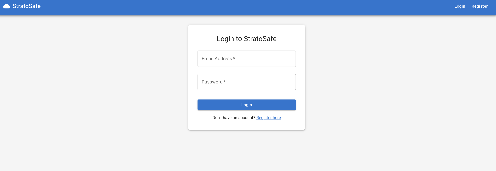
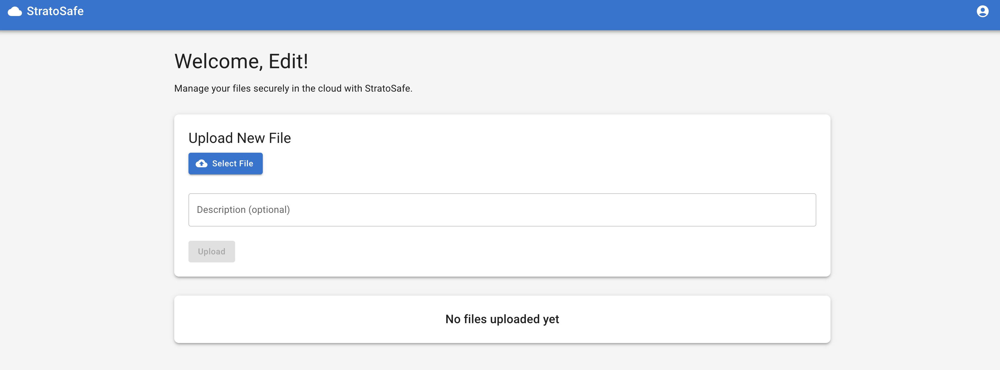
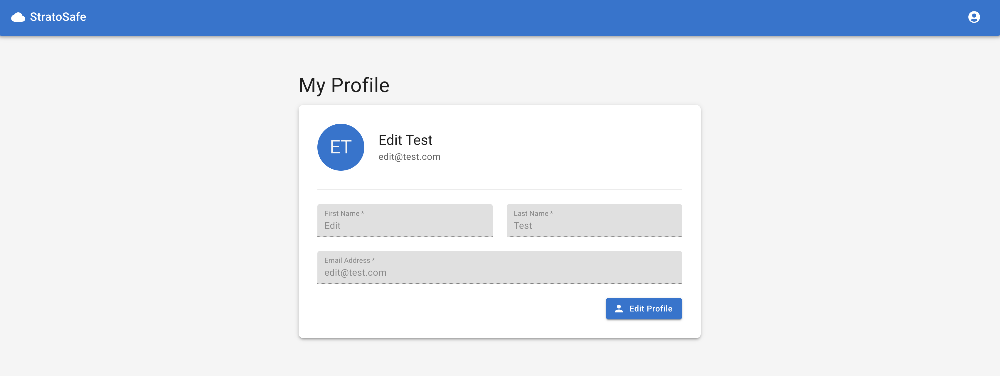
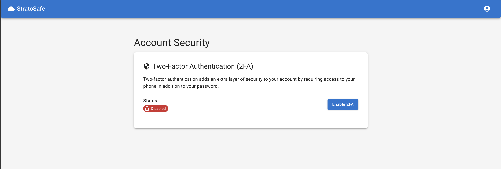
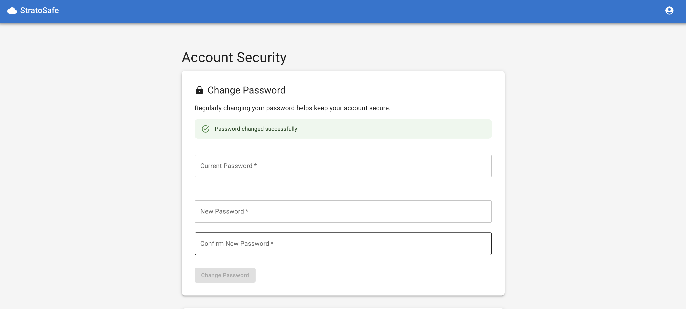

# StratoSafe
<!-- markdownlint-disable MD033 -->

<p align="center">
  
</p>

<p align="center">
  <strong>Secure Your Files in the Cloud</strong>
</p>

## What is StratoSafe?

StratoSafe is a modern, secure cloud storage solution that allows individuals and teams to safely store, manage, and share files online. Built with TypeScript, React, and Node.js, it provides an intuitive interface for file management while maintaining robust security through JWT authentication.

### Key Features

- **Secure Authentication**: User accounts with email/password login protected by JWT tokens
- **File Management**: Easily upload, download, organize, and remove files
- **Responsive Design**: Mobile-friendly interface built with Material UI
- **Modern Architecture**: Monorepo structure with TypeScript for both frontend and backend
- **Containerized Deployment**: Docker-ready for easy deployment in any environment

Whether you're looking for personal cloud storage or a team collaboration tool, StratoSafe offers the perfect balance of security, simplicity, and performance.

<p align="center">
  <a href="#features">Features</a> •
  <a href="#demo">Demo</a> •
  <a href="#quick-start">Quick Start</a> •
  <a href="#installation">Installation</a> •
  <a href="#usage">Usage</a> •
  <a href="#tech-stack">Tech Stack</a> •
  <a href="#contributing">Contributing</a> •
  <a href="#license">License</a>
</p>

## Features

- **🔐 Secure Authentication** - JWT-based login with multi-factor authentication (MFA) support
- **📁 File Management** - Upload, download, organize, and manage your files with ease
- **🛡️ Privacy-Focused** - Role-based access control ensures your files stay secure
- **🎨 Modern UI** - Clean, responsive design with Material UI and dark mode support
- **🚀 Easy Deployment** - Docker-ready for quick deployment anywhere
- **📱 Mobile-Friendly** - Access your files on any device, anytime
- **⚙️ Admin Controls** - System settings and user management for administrators

## Demo

Login Page:



File Upload Page:



Profile Edit Page:



### Security Settings Pages

MFA Registration Page:



Change Password Page: 



## Quick Start

Get StratoSafe running in just 3 commands:

```bash
# 1. Clone the repository
git clone https://github.com/stephondoestech/stratosafe.git
cd stratosafe

# 2. Set up environment configuration
make config

# 3. Start with Docker
make docker
```

**Important:** Edit the `.env` file to set a secure JWT secret before running:
```bash
# Generate a secure JWT secret (required)
openssl rand -base64 32
```

Then open **http://localhost:3000** in your browser to get started!

## Installation

### Prerequisites

- [Node.js](https://nodejs.org/) (v16 or later)
- [Yarn](https://yarnpkg.com/)
- [Docker & Docker Compose](https://docs.docker.com/compose/install/) (for containerized deployment)
- [PostgreSQL](https://www.postgresql.org/) (if running locally without Docker)

### Setup

1. **Clone the repository:**
   ```bash
   git clone https://github.com/stephondoestech/stratosafe.git
   cd stratosafe
   ```

2. **Install dependencies:**
   ```bash
   make install
   # or
   yarn install
   ```

3. **Configure environment variables:**
   ```bash
   # Create .env file from template
   make config
   
   # Edit .env file with your settings (especially JWT_SECRET!)
   # Generate a secure JWT secret: openssl rand -base64 32
   ```

4. **Build the project:**
   ```bash
   make build
   # or
   yarn build
   ```

## Usage

### Running Locally

```bash
make run
# or
yarn start
```

This will start both the backend server and the frontend development server concurrently.

- Backend API will be available at: http://localhost:3001
- Frontend will be available at: http://localhost:3000

### Running with Docker

```bash
# Option 1: Using the Makefile (Recommended)
make docker

# Option 2: Using Docker Compose directly
docker-compose up --build

# Run in detached mode (background)
docker-compose up --build -d

# Check container status
docker-compose ps

# View logs
docker-compose logs -f

# Stop all services
docker-compose down
```

This will build and start all services using Docker Compose:

1. **PostgreSQL database** - Stores user accounts and file metadata
2. **Backend API** - Node.js server running on port 3001
3. **Frontend** - React application served on port 3000

All data is persisted in Docker volumes, so you won't lose information when containers restart.

### Available Commands

- `make config` - Create .env file from template
- `make install` - Install dependencies
- `make build` - Build the project
- `make run` - Run the project locally
- `make docker` - Run the project with Docker

## Tech Stack

### Backend
- **[Node.js](https://nodejs.org/)** - JavaScript runtime
- **[Express](https://expressjs.com/)** - Web framework
- **[TypeORM](https://typeorm.io/)** - ORM for database interaction
- **[PostgreSQL](https://www.postgresql.org/)** - Relational database
- **[TypeScript](https://www.typescriptlang.org/)** - Type-safe JavaScript

### Frontend
- **[React](https://reactjs.org/)** - UI library
- **[Material UI](https://mui.com/)** - Component library
- **[React Router](https://reactrouter.com/)** - Routing
- **[Axios](https://axios-http.com/)** - HTTP client

### Infrastructure
- **[Docker](https://www.docker.com/)** - Containerization
- **[Yarn Workspaces](https://classic.yarnpkg.com/en/docs/workspaces/)** - Monorepo management
- **[Nginx](https://nginx.org/)** - Web server for frontend (in Docker)

## Contributing

Contributions are welcome! Please follow these steps to contribute:

1. **Open an Issue First**: Before starting work, please open a GitHub issue describing the change you wish to make. This allows for discussion and ensures your time is well spent.
2. **Request Assignment**: Comment on the issue requesting to be assigned to it. This helps prevent duplicate work.
3. **Follow Branch Naming Convention**: All branches should follow our naming convention:
   ```
   <prefix>/<work-item-identifier>-<short-description>
   ```
   
   Where:
   - `<prefix>` is one of: `feature`, `bugfix`, `hotfix`, `task`, or `patch`
   - `<work-item-identifier>` is the issue number (e.g., GH-123)
   - `<short-description>` is a brief, hyphenated description

   Example: `feature/GH-45-user-authentication`

4. **Fork the repository**
5. **Create your branch** following the naming convention
6. **Commit your changes** (`git commit -m 'Add some amazing feature'`)
7. **Push to the branch** (`git push origin feature/GH-45-user-authentication`)
8. **Open a Pull Request**

**Note**: Pull requests with passing tests are reviewed on a weekly basis. Including tests with your contribution will speed up the review process.

## License

This project is licensed under the MIT License - see the [LICENSE](LICENSE) file for details.
